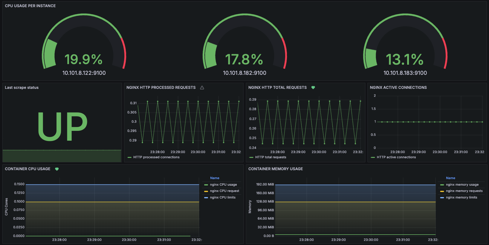
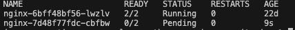

# Evaluation criteria

## Grafana dashboards

The dashboard can be found in the [dashboard.json](./grafana/dashboard.json) file. Dashboard screenshot: 

## Grafana alerts

The Grafana alerts rules can be found in the [alarms.yaml](./grafana/alarms.yaml) file.
> [!NOTE]  
> These alerts use a local datasource, they shoould be updated with the corresponding datasource.

Alerts screenshot: 

## Prometheus Unit Tests

The Grafana alerts tests can be found in the [tests](./test) directory.
We need [promtool](https://prometheus.io/docs/prometheus/latest/command-line/promtool/) as a pre-requirement to execute the tests.
To execute the test, run the following command:

```bash
promtool test rules test/alerts-tests.yaml
```

For this section, we have to recreate the alarms from Grafana to be Prometheus alarms rules. These can be find in [alerts.yaml](./test/alerts.yaml). We use the same query as in Grafana and included the expression at the same level.

*TODO*:

- [] Implement pending alerts tests

## Load test

We used the [generate_load.py](./generate_load.py) script to simulate requests to the nginx server. It triggers the __Http requests increased by 20%__ alarm as observed on the next images:


To trigger __Pod Status Not Ready__ alarm, we need to patch the current deployment:

```bash
kubectl patch deployment nginx --patch "$(cat nginx-patch.yaml)" 
```

Which results in the following state for the new deployment:


We need to wait 5 minutes to trigger the alar, as we set the `Pending period` to 5min. After that the alarm will be triggered:


To revert to previous deployment version:

```bash
kubectl rollout undo deploy/nginx
```
